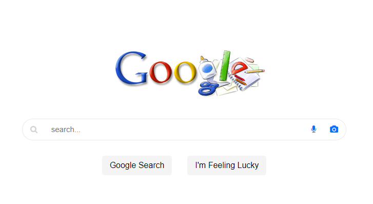

# Google Clone

A Google clone website built to visually and functionally resemble Google search page. The website has three pages: main search page, image search page, and the advanced search page.

# Tech stack

Here is an overview of all the tools used to build the site:

* HTML
* CSS

# Supporting browser

So far, the app can be run on Microsoft Edge, Chrome and Firefox

#
<!-- Here is the link to my link to my hosted working app => [Trading-Avenue](https://trading-avenue.onrender.com/)

Thank you for visiting! -->

